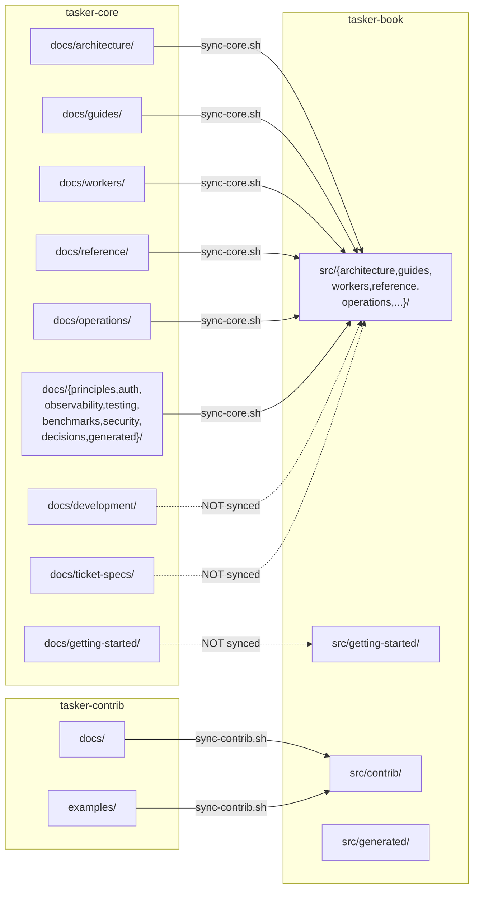

# Documentation Architecture

This document defines the single-source-of-truth ownership model for documentation across the Tasker ecosystem. It establishes which repository owns which content, how content flows between repos, and where to author new documentation.

## Ownership Model

Each repository owns specific categories of documentation. Ownership means: **that repo is where the authoritative version lives and where edits are made.**

### tasker-core (`tasker-core/docs/`)

Owns **contributor-facing** and **architecture reference** content:

| Category | Path | Description |
|----------|------|-------------|
| Architecture | `docs/architecture/` | System design, actors, state machines, deployment patterns |
| Principles | `docs/principles/` | Core tenets, design philosophy |
| Guides | `docs/guides/` | Practical implementation guides (quick-start, workflows, caching) |
| Workers | `docs/workers/` | Language-specific handler development |
| Reference | `docs/reference/` | SQL functions, table management, FFI telemetry |
| Operations | `docs/operations/` | Channel tuning, backpressure monitoring |
| Observability | `docs/observability/` | Metrics, logging, tracing |
| Testing | `docs/testing/` | Test infrastructure, cluster testing |
| Benchmarks | `docs/benchmarks/` | Performance validation |
| Security | `docs/security/` | Security documentation |
| Auth | `docs/auth/` | Authentication and authorization |
| Decisions | `docs/decisions/` | Architecture Decision Records (ADRs) |
| Development | `docs/development/` | Contributor tooling and patterns (internal, not synced) |
| Ticket Specs | `docs/ticket-specs/` | Feature specifications (internal, not synced) |
| Getting Started | `docs/getting-started/` | **Contributor onboarding** (dev environment, running tests) |

### tasker-book (`tasker-book/src/`)

Owns **consumer-facing** documentation:

| Category | Path | Description |
|----------|------|-------------|
| Getting Started | `src/getting-started/` | Consumer onboarding, installation, first handler/workflow |
| Stories | `src/stories/` | Blog-style narrative content |
| Contrib | `src/contrib/` | tasker-contrib overview and example app documentation |
| Generated | `src/generated/` | Auto-generated reference docs (diagrams, schemas, guides) |

The book also **syncs** content from tasker-core and tasker-contrib (see Content Flow below).

### tasker-contrib

Owns **example application** and **SDK** documentation:

| Category | Path | Description |
|----------|------|-------------|
| Example READMEs | `examples/*/README.md` | Per-example-app documentation |
| SDK docs | `docs/` | Framework integration documentation |

## Content Flow

### What Syncs (via `sync-core.sh`)

These directories are copied from `tasker-core/docs/` into `tasker-book/src/` using `rsync --delete`:

- `architecture/` — System design docs
- `auth/` — Authentication reference
- `benchmarks/` — Performance docs
- `decisions/` — ADRs
- `generated/` — Core-generated content (with local file preservation)
- `guides/` — Implementation guides
- `observability/` — Monitoring docs
- `operations/` — Production operations
- `principles/` — Design philosophy
- `reference/` — Technical specifications
- `security/` — Security docs
- `testing/` — Test documentation
- `workers/` — Language-specific worker docs

Additionally, `why-tasker.md` is copied as a standalone file.

### What Does NOT Sync

| Directory | Reason |
|-----------|--------|
| `getting-started/` | Book owns consumer getting-started; core's version is contributor-focused |
| `development/` | Internal contributor tooling, not consumer-relevant |
| `ticket-specs/` | Internal planning documents (~176 files) |

### What Syncs from tasker-contrib (via `sync-contrib.sh`)

- `docs/README.md` — Contrib overview
- `examples/` — Example application source and READMEs

## Authoring Rules

When writing new documentation, use this decision tree:

1. **Is it about how to _use_ Tasker as a consumer?**
   - Getting started, tutorials, onboarding → **Author in tasker-book** (`src/getting-started/`)
   - Example app walkthroughs → **Author in tasker-book** (`src/contrib/`)

2. **Is it about Tasker's internal architecture, design, or operation?**
   - Architecture, guides, reference, operations → **Author in tasker-core** (`docs/`)
   - These will be synced to the book automatically

3. **Is it about a specific example app or SDK?**
   - Example README → **Author in tasker-contrib** (`examples/*/README.md`)
   - SDK documentation → **Author in tasker-contrib** (`docs/`)
   - These will be synced to the book automatically

4. **Is it contributor-focused (how to develop Tasker itself)?**
   - Dev environment, tooling, coding standards → **Author in tasker-core** (`docs/development/`)
   - This content is NOT synced to the book

5. **Is it auto-generated from source analysis?**
   - Book-generated (diagrams, schemas) → **Generated in tasker-book** (`src/generated/`)
   - Core-generated → **Generated in tasker-core** (`docs/generated/`)

## Generated Content

### Auto-generated by tasker-book build pipeline

These files in `src/generated/` are produced by scripts in `cargo-make/scripts/`:

| File | Generator | Source |
|------|-----------|--------|
| `crate-dependency-graph.md` | `generate-crate-deps.sh` | tasker-core `Cargo.toml` files |
| `state-machine-diagrams.md` | `generate-state-machines.sh` | tasker-core Rust source |
| `database-schema.md` | `generate-db-schema.sh` | tasker-core SQL migrations |
| `adr-summary.md` | `generate-adr-summary.sh` | tasker-core ADR files (LLM-assisted) |
| `config-operational-guide.md` | `generate-config-guide.sh` | tasker-core TOML configs (LLM-assisted) |
| `error-troubleshooting-guide.md` | `generate-error-guide.sh` | tasker-core source (LLM-assisted) |

### Hand-written content

Everything not listed above is hand-written. The `SUMMARY.md` table of contents is auto-generated from directory structure by `generate-summary.sh`.

## Cross-Reference Conventions

- **Within a repo**: Use relative markdown links (`[Actors](architecture/actors.md)`)
- **From core/contrib to the book**: Use GitHub URLs (`[The Tasker Book](https://github.com/tasker-systems/tasker-book)`)
- **From the book to core/contrib source**: Use GitHub URLs when linking to source code, relative links when linking to synced content already in the book
- **This document**: Referenced from other repos via `[Documentation Architecture](https://github.com/tasker-systems/tasker-book/blob/main/DOCUMENTATION-ARCHITECTURE.md)`
