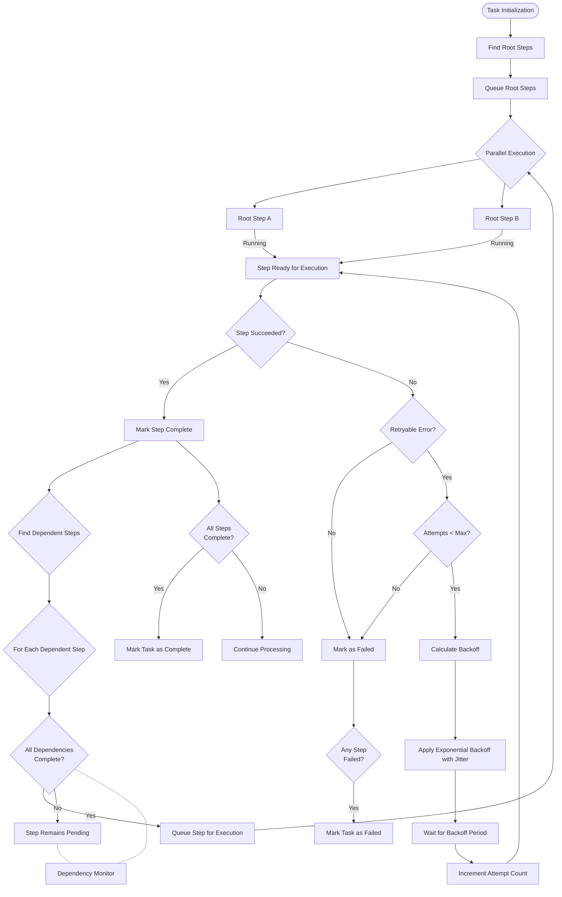

# System Overview

Tasker is a production-ready workflow orchestration engine built for Ruby on Rails applications. It provides robust task management, dependency resolution, and distributed system coordination through a declarative workflow definition approach.

## Core Architecture

### Registry System Architecture

Tasker's registry systems provide enterprise-grade capabilities for managing task handlers, plugins, and event subscribers:

#### Thread-Safe Registry Operations

All registry systems use `Concurrent::Hash` for thread-safe operations:

```ruby
# HandlerFactory - Thread-safe task handler management
Tasker::HandlerFactory.instance.register(
  'payment_processor',
  PaymentHandler,
  namespace_name: 'payments',
  version: '2.1.0',
  replace: true  # Graceful conflict resolution
)

# PluginRegistry - Format-based plugin discovery
Tasker::Telemetry::PluginRegistry.register(
  'custom_exporter',
  CustomExporter,
  format: :json,
  replace: true
)

# SubscriberRegistry - Event subscriber management
Tasker::Registry::SubscriberRegistry.register(
  'notification_subscriber',
  NotificationSubscriber,
  events: ['task.completed', 'task.failed']
)
```

#### Structured Logging and Observability

Registry operations include comprehensive structured logging with correlation IDs:

```json
{
  "timestamp": "2024-01-15T10:30:45Z",
  "correlation_id": "tsk_abc123_def456",
  "component": "handler_factory",
  "message": "Registry item registered",
  "environment": "production",
  "tasker_version": "1.0.0",
  "process_id": 12345,
  "thread_id": "abc123",
  "entity_type": "task_handler",
  "entity_id": "payments/payment_processor/2.1.0",
  "entity_class": "PaymentHandler",
  "registry_name": "handler_factory",
  "options": {
    "namespace_name": "payments",
    "version": "2.1.0",
    "replace": true
  },
  "event_type": "registered"
}
```

#### Interface Validation & Error Handling

Comprehensive validation prevents runtime errors:

```ruby
# Fail-fast validation with detailed error messages
begin
  Tasker::HandlerFactory.instance.register('invalid_handler', InvalidClass)
rescue Tasker::Registry::ValidationError => e
  # Detailed error with context and suggestions
  puts e.message
  # => "Handler validation failed: InvalidClass does not implement required method 'process'.
  #     Required methods: [process, initialize_task!].
  #     Suggestion: Inherit from Tasker::TaskHandler::Base"
end
```

#### Registry Statistics & Health Monitoring

Built-in monitoring and statistics:

```ruby
# Comprehensive registry statistics
stats = Tasker::HandlerFactory.instance.stats
# => {
#   total_handlers: 45,
#   namespaces: ["payments", "inventory", "notifications"],
#   versions: ["1.0.0", "1.1.0", "2.0.0"],
#   thread_safe: true,
#   last_registration: "2024-01-15T10:30:45Z"
# }

# Health check integration
health = Tasker::HandlerFactory.instance.health_check
# => { status: "healthy", registry_size: 45, thread_safe: true }
```

## Event System Architecture

Tasker features a comprehensive event-driven architecture that provides both deep observability and powerful developer integration capabilities:

### Event Categories

- **Task Events** (`Tasker::Constants::TaskEvents`) - Task lifecycle events (started, completed, failed)
- **Step Events** (`Tasker::Constants::StepEvents`) - Step execution events with error context
- **Workflow Events** (`Tasker::Constants::WorkflowEvents`) - Orchestration and dependency management
- **Observability Events** (`Tasker::Constants::ObservabilityEvents`) - Performance monitoring and metrics

### Event Discovery and Integration

The event system includes a comprehensive catalog for discovering and understanding events:

```ruby
# Discover all available events
Tasker::Events.catalog.keys
# => ["task.started", "task.completed", "task.failed", "step.started", ...]

# Get detailed event information
Tasker::Events.event_info('task.completed')
# => {
#   name: "task.completed",
#   category: "task",
#   description: "Fired when a task completes successfully",
#   payload_schema: { task_id: String, execution_duration: Float },
#   example_payload: { task_id: "task_123", execution_duration: 45.2 },
#   fired_by: ["TaskFinalizer", "TaskHandler"]
# }
```

### Custom Event Subscribers

Create custom integrations with external services using the subscriber generator:

```bash
# Generate a subscriber with specific events
rails generate tasker:subscriber notification --events task.completed task.failed step.failed
```

This creates a complete subscriber class with automatic method routing:

```ruby
class NotificationSubscriber < Tasker::Events::Subscribers::BaseSubscriber
  subscribe_to 'task.completed', 'task.failed', 'step.failed'

  def handle_task_completed(event)
    task_id = safe_get(event, :task_id)
    NotificationService.send_success_email(task_id: task_id)
  end

  def handle_task_failed(event)
    task_id = safe_get(event, :task_id)
    error_message = safe_get(event, :error_message, 'Unknown error')
    AlertService.send_failure_alert(task_id: task_id, error: error_message)
  end
end
```

### Publishing Events

```ruby
class MyStepHandler
  include Tasker::Concerns::EventPublisher

  def handle(task, sequence, step)
    publish_step_started(step)

    # Your business logic here
    result = perform_operation(task.context)
    step.results = { data: result }

    # Completion event with additional context
    publish_step_completed(step, operation_count: result.size)
  end
end
```

### OpenTelemetry Integration

Comprehensive observability stack including:

- **Database Query Monitoring** - PostgreSQL instrumentation with connection safety
- **Background Job Tracking** - Sidekiq, Redis, and concurrent processing
- **API Call Tracing** - HTTP requests with proper error handling
- **State Machine Transitions** - Complete audit trail of workflow state changes

For detailed telemetry configuration, see [TELEMETRY.md](TELEMETRY.md).

## Workflow Configuration

### YAML-Based Task Definition

Tasks are defined using declarative YAML configuration:

```yaml
---
name: api_task/integration_yaml_example
module_namespace: ApiTask
task_handler_class: IntegrationYamlExample

default_dependent_system: ecommerce_system

named_steps:
  - fetch_cart
  - fetch_products
  - validate_products
  - create_order
  - publish_event

schema:
  type: object
  required:
    - cart_id
  properties:
    cart_id:
      type: integer

step_templates:
  - name: fetch_cart
    description: Fetch cart details from e-commerce system
    handler_class: ApiTask::StepHandler::CartFetchStepHandler
    handler_config:
      type: api
      url: https://api.ecommerce.com/cart
      params:
        cart_id: 1

  - name: fetch_products
    description: Fetch product details from product catalog
    handler_class: ApiTask::StepHandler::ProductsFetchStepHandler
    handler_config:
      type: api
      url: https://api.ecommerce.com/products

  - name: validate_products
    description: Validate product availability
    depends_on_steps:
      - fetch_products
      - fetch_cart
    handler_class: ApiTask::StepHandler::ProductsValidateStepHandler

  - name: create_order
    description: Create order from validated cart
    depends_on_step: validate_products
    handler_class: ApiTask::StepHandler::CreateOrderStepHandler

  - name: publish_event
    description: Publish order created event
    depends_on_step: create_order
    handler_class: ApiTask::StepHandler::PublishEventStepHandler
```

### Environment-Specific Configuration

Tasker supports environment-specific configuration overrides:

```yaml
environments:
  development:
    step_templates:
      - name: fetch_cart
        handler_config:
          url: http://localhost:3000/api/cart
          params:
            cart_id: 1
            debug: true

  production:
    step_templates:
      - name: fetch_cart
        handler_config:
          url: https://api.ecommerce.com/cart
          params:
            cart_id: 1
            api_key: ${ECOMMERCE_API_KEY}
```

Configuration is merged at runtime, with environment-specific settings taking precedence over base configuration. This supports:

- Different API endpoints per environment
- Debug mode enablement in development
- Secure credential management in production

## REST API Interface

Tasker provides a comprehensive RESTful API for task management:

### Task Management

- `GET /tasker/tasks` - List all tasks
- `POST /tasker/tasks` - Create and enqueue a new task
- `GET /tasker/tasks/{task_id}` - Get task details
- `PATCH/PUT /tasker/tasks/{task_id}` - Update task
- `DELETE /tasker/tasks/{task_id}` - Cancel task

### Workflow Step Management

- `GET /tasker/tasks/{task_id}/workflow_steps` - List steps for a task
- `GET /tasker/tasks/{task_id}/workflow_steps/{step_id}` - Get step details
- `PATCH/PUT /tasker/tasks/{task_id}/workflow_steps/{step_id}` - Update step
- `DELETE /tasker/tasks/{task_id}/workflow_steps/{step_id}` - Cancel step

### Task Visualization

- `GET /tasker/tasks/{task_id}/diagram` - Get a diagram for a task

### Creating Tasks via API

Example task creation:

```bash
curl -X POST https://www.example.com/tasker/tasks \
  -H "Content-Type: application/json" \
  -d '{
    "name": "api_integration_task",
    "context": {
      "cart_id": 123
    },
    "initiator": "web_interface",
    "reason": "Process new order",
    "source_system": "ecommerce",
    "tags": ["order_processing", "api_integration"]
  }'
```

Required fields:
- `name`: Task handler identifier
- `context`: Task context data
- `initiator`: Task initiator
- `reason`: Task creation reason
- `source_system`: Source system identifier
- `tags`: (Optional) Categorization tags

## Workflow Execution and Orchestration



### Orchestration Features

- **DAG Traversal & Parallel Execution**
  - Initial identification and queueing of root steps (no dependencies)
  - Parallel execution of independent steps at each level
  - Dynamic discovery of next executable steps as dependencies are satisfied
  - Continuous monitoring of dependency status to activate pending steps
  - Automatic task completion detection when all steps are finished

- **Exponential Backoff Retry Logic**
  - Base delay that doubles with each attempt: `base_delay * (2^attempt)`
  - Random jitter to prevent thundering herd problems
  - Configurable maximum delay cap (30 seconds)
  - Respects server-provided Retry-After headers when available

- **Production-Ready Error Handling & Persistence**
  - Complete step error persistence with full error context, backtrace, and attempt tracking
  - Atomic transactions with save-first, transition-second pattern ensuring data integrity
  - Memory-safe processing with database connection pooling and explicit cleanup
  - Comprehensive event publishing for both success and error paths
  - Zero data loss with proper persistence of all step executions

- **Task Status Management**
  - Real-time monitoring of all step statuses with unified event system
  - Early failure detection and propagation with comprehensive error data
  - Graceful handling of unrecoverable errors with full audit trail
  - OpenTelemetry integration for complete observability

## Production Features

- **Thread-safe registry systems** with structured logging
- **Unified event system** with standardized event payloads
- **Complete step error persistence** with atomic transactions
- **Production-ready OpenTelemetry integration** with safety mechanisms
- **Memory-safe operation** with database connection pooling
- **Developer-friendly API** with clean integration patterns

For detailed orchestration patterns and control flow, see [Task Execution Control Flow](TASK_EXECUTION_CONTROL_FLOW.md).

For comprehensive API documentation, see [REST API Reference](REST_API.md).

For complete event system documentation, see [EVENT_SYSTEM.md](EVENT_SYSTEM.md).