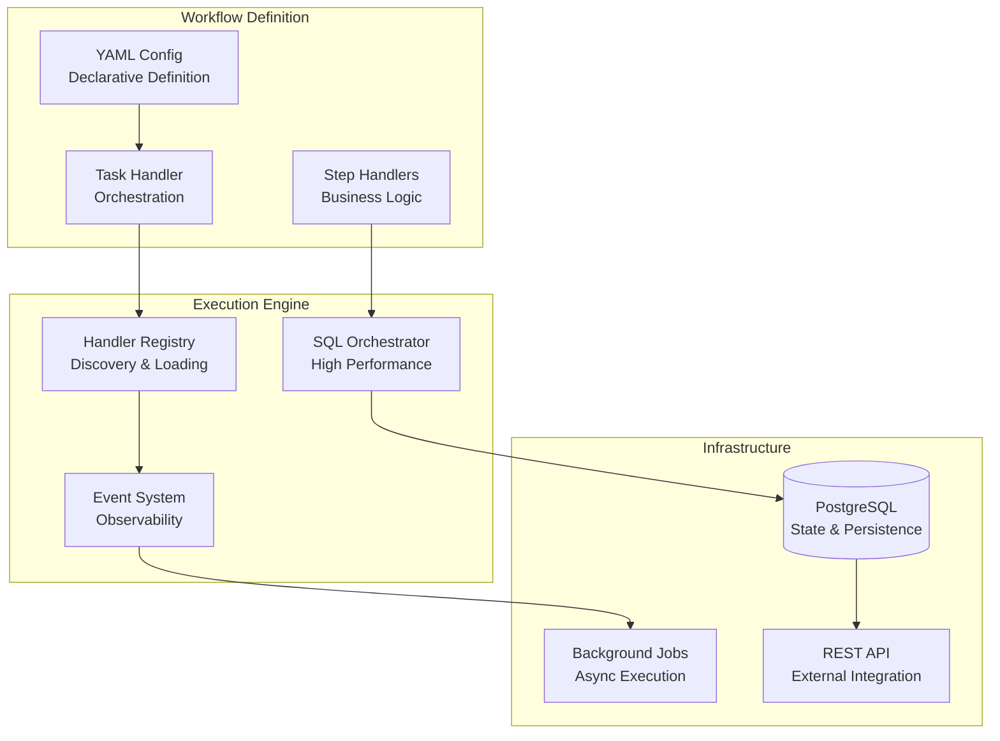

# Core Concepts

> **Understanding Tasker's architecture and key components**

This guide explains the fundamental concepts that make Tasker a powerful workflow orchestration engine. Understanding these concepts will help you design better workflows and debug issues more effectively.

## Architecture Overview

Tasker is built around six main components that work together to provide reliable workflow orchestration:



## 1. Task Handlers
*Workflow orchestration and step coordination*

**Purpose**: Define the structure, dependencies, and configuration of multi-step workflows.

**Key Responsibilities**:
- Define step sequences and dependencies
- Validate input context
- Register with the handler registry
- Configure retry policies and timeouts

### Basic Structure

```ruby
class OrderProcessingHandler < Tasker::TaskHandler::Base
  TASK_NAME = 'process_order'
  NAMESPACE = 'ecommerce'
  VERSION = '2.1.0'
  
  # Register with the handler registry
  register_handler(TASK_NAME, namespace_name: NAMESPACE, version: VERSION)
  
  # Define workflow structure
  define_step_templates do |templates|
    templates.define(
      name: 'validate_payment',
      handler_class: 'Ecommerce::StepHandlers::ValidatePaymentHandler',
      retryable: true,
      retry_limit: 3
    )
    
    templates.define(
      name: 'reserve_inventory',
      depends_on_step: 'validate_payment',
      handler_class: 'Ecommerce::StepHandlers::ReserveInventoryHandler'
    )
  end
  
  # Define input validation schema
  def schema
    {
      type: 'object',
      required: ['order_id'],
      properties: {
        order_id: { type: 'integer' },
        priority: { type: 'string', enum: ['normal', 'high', 'urgent'] }
      }
    }
  end
end
```

### Key Features

**Step Dependencies**: Steps execute only after their dependencies complete
```ruby
templates.define(
  name: 'send_confirmation',
  depends_on_step: ['validate_payment', 'reserve_inventory']  # Waits for both
)
```

**Parallel Execution**: Independent steps run simultaneously
```ruby
# These three steps run in parallel
templates.define(name: 'check_credit')
templates.define(name: 'verify_address')  
templates.define(name: 'validate_inventory')
```

**Error Handling Configuration**: Different retry strategies per step
```ruby
templates.define(
  name: 'external_api_call',
  retryable: true,
  retry_limit: 5,           # External APIs can be flaky
  timeout: 30000            # 30 second timeout
)

templates.define(
  name: 'database_operation',
  retryable: true,
  retry_limit: 2,           # Database should be reliable
  timeout: 5000             # 5 second timeout
)
```

## 2. Step Handlers
*Individual step business logic implementation*

**Purpose**: Implement the actual business logic for each workflow step.

**Key Responsibilities**:
- Execute business operations
- Handle errors appropriately
- Return results for dependent steps
- Maintain idempotency

### Basic Structure

```ruby
module Ecommerce
  module StepHandlers
    class ValidatePaymentHandler < Tasker::StepHandler::Base
      def process(task, sequence, step)
        # Access task context
        order_id = task.context['order_id']
        order = Order.find(order_id)
        
        # Execute business logic
        payment_result = PaymentService.validate(order.payment_method)
        
        # Handle different outcomes
        if payment_result.success?
          {
            payment_validated: true,
            payment_id: payment_result.id,
            amount_charged: payment_result.amount
          }
        else
          # Decide if error is retryable
          case payment_result.error_code
          when 'timeout', 'server_error'
            raise Tasker::RetryableError, payment_result.error_message
          when 'invalid_card', 'insufficient_funds'
            raise Tasker::PermanentError, payment_result.error_message
          end
        end
      end
    end
  end
end
```

### Error Handling Patterns

**Retryable Errors**: Temporary failures that should be retried
```ruby
# Network timeouts, rate limits, temporary service unavailability
raise Tasker::RetryableError, "Payment gateway timeout"

# Custom retry delay
raise Tasker::RetryableError.new("Rate limited", delay: 60.seconds)
```

**Permanent Errors**: Failures that won't succeed on retry
```ruby
# Invalid data, authorization failures, business rule violations
raise Tasker::PermanentError, "Invalid credit card number"
```

**Standard Errors**: Treated as permanent failures
```ruby
# Any unhandled StandardError fails permanently
raise ArgumentError, "Missing required parameter"
```

### Result Passing

Step results are automatically persisted and available to dependent steps:

```ruby
def process(task, sequence, step)
  # Access results from previous steps
  payment_results = step_results(sequence, 'validate_payment')
  payment_id = payment_results['payment_id']
  
  # Use the data in business logic
  inventory_result = InventoryService.reserve(
    order_id: task.context['order_id'],
    payment_confirmation: payment_id
  )
  
  # Return results for dependent steps
  {
    inventory_reserved: true,
    reservation_id: inventory_result.id,
    items_reserved: inventory_result.items
  }
end
```

## 3. Workflow Orchestration
*SQL-powered step coordination*

**Purpose**: Coordinate step execution based on dependencies while maintaining high performance and reliability.

### Dependency Resolution

Tasker uses PostgreSQL functions for sub-millisecond dependency resolution:

```sql
-- Find steps ready to execute
SELECT tasker_get_ready_steps('ecommerce', 'process_order', task_id);

-- Update step status atomically
SELECT tasker_update_step_status(step_id, 'running', 'completed');

-- Resolve dependencies for next steps
SELECT tasker_resolve_dependencies(task_id);
```

### Execution Patterns

**Linear Workflow**: Sequential step execution
```
validate_order → process_payment → ship_order → send_confirmation
```

**Parallel Workflow**: Independent concurrent execution  
```
             ┌─ check_inventory
validate_order ├─ validate_payment
             └─ verify_customer
```

**Diamond Pattern**: Fan-out then fan-in
```
                ┌─ check_credit ──┐
validate_input ─┼─ verify_address ─┼─ complete_order
                └─ check_inventory ┘
```

**Complex Dependencies**: Multiple prerequisite steps
```
load_data → ┌─ transform_data ──┐
            │                   ├─ generate_report
validate ───┼─ enrich_data ─────┘
            │
            └─ audit_log
```

## 4. Event System
*Observability and integration capabilities*

**Purpose**: Provide real-time visibility into workflow execution and enable integrations with external systems.

### Event Types

Tasker publishes events throughout the workflow lifecycle:

```ruby
# Workflow events
'task.started'     # Workflow begins execution
'task.completed'   # All steps completed successfully
'task.failed'      # Workflow failed permanently

# Step events  
'step.started'     # Step begins execution
'step.completed'   # Step completed successfully
'step.failed'      # Step failed (may retry)
'step.retried'     # Step is being retried
```

### Event Structure

Each event contains comprehensive context information:

```ruby
{
  type: 'step.completed',
  task_id: 'uuid-1234',
  step_name: 'validate_payment',
  namespace: 'ecommerce',
  task_name: 'process_order',
  version: '2.1.0',
  context: { order_id: 12345 },
  result: { payment_id: 'pay_xyz', amount: 99.99 },
  duration: 1250,  # milliseconds
  timestamp: '2024-01-15T10:30:00Z',
  correlation_id: 'req_abc123'
}
```

### Event Subscribers

Create custom integrations by subscribing to events:

```ruby
class OrderMonitor < Tasker::EventSubscriber::Base
  subscribe_to 'step.completed', 'step.failed', 'task.completed'
  
  def handle_step_completed(event)
    if event[:namespace] == 'ecommerce' && event[:step_name] == 'validate_payment'
      # Update analytics
      Analytics.track('payment_processed', {
        order_id: event[:context]['order_id'],
        amount: event[:result]['amount'],
        duration_ms: event[:duration]
      })
    end
  end
  
  def handle_step_failed(event)
    if event[:namespace] == 'ecommerce'
      # Alert the operations team
      SlackAPI.post_message(
        channel: '#ecommerce-alerts',
        text: "🚨 Order processing failed: #{event[:step_name]} - #{event[:error]}"
      )
    end
  end
  
  def handle_task_completed(event)
    if event[:namespace] == 'ecommerce'
      # Send order confirmation
      order_id = event[:context]['order_id']
      OrderMailer.confirmation_email(order_id).deliver_now
    end
  end
end
```

## 5. Namespace & Versioning
*Enterprise-scale organization*

**Purpose**: Organize workflows by business domain and enable safe evolution through semantic versioning.

### Namespace Organization

Organize workflows by business capability:

```ruby
# Payment processing workflows
namespace: 'payments'
tasks: ['process_payment', 'process_refund', 'update_billing']

# Inventory management workflows  
namespace: 'inventory'
tasks: ['reserve_items', 'update_stock', 'reorder_products']

# Customer communication workflows
namespace: 'notifications'
tasks: ['welcome_email', 'order_updates', 'marketing_campaigns']

# Data processing workflows
namespace: 'data_processing'
tasks: ['daily_etl', 'user_analytics', 'report_generation']
```

### Semantic Versioning

Multiple versions can coexist safely:

```ruby
# Version 1.0.0 - Original implementation
class ProcessOrderHandler < Tasker::TaskHandler::Base
  register_handler('process_order', namespace_name: 'ecommerce', version: '1.0.0')
  
  define_step_templates do |templates|
    templates.define(name: 'validate_order')
    templates.define(name: 'process_payment', depends_on_step: 'validate_order')
  end
end

# Version 2.0.0 - Added inventory check
class ProcessOrderHandler < Tasker::TaskHandler::Base
  register_handler('process_order', namespace_name: 'ecommerce', version: '2.0.0')
  
  define_step_templates do |templates|
    templates.define(name: 'validate_order')
    templates.define(name: 'check_inventory', depends_on_step: 'validate_order')
    templates.define(name: 'process_payment', depends_on_step: ['validate_order', 'check_inventory'])
  end
end
```

### Version Selection

Choose versions explicitly when running workflows:

```ruby
# Run legacy version for existing orders
legacy_request = Tasker::Types::TaskRequest.new(
  name: 'process_order',
  namespace: 'ecommerce',
  version: '1.0.0',  # Specific version
  context: { order_id: 12345 }
)

# Run latest version for new orders
current_request = Tasker::Types::TaskRequest.new(
  name: 'process_order',
  namespace: 'ecommerce',
  version: '2.0.0',  # Latest version
  context: { order_id: 67890 }
)
```

## 6. Handler Registry
*Discovery and loading system*

**Purpose**: Automatically discover, load, and manage workflow handlers with thread-safe operations.

### Automatic Discovery

Tasker automatically discovers handlers in your application:

```ruby
# Handlers are automatically registered when classes are loaded
Tasker::HandlerFactory.instance.handlers.keys
# => ['ecommerce/process_order', 'payments/process_refund', 'notifications/welcome_email']

# Get specific handler
handler = Tasker::HandlerFactory.instance.get(
  'process_order',
  namespace_name: 'ecommerce',
  version: '2.0.0'
)
```

### Thread-Safe Operations

The registry handles concurrent access safely:

```ruby
# Multiple threads can safely access the registry
threads = 10.times.map do |i|
  Thread.new do
    # Each thread gets correct handler instance
    handler = Tasker::HandlerFactory.instance.get('process_order', 
                                                  namespace_name: 'ecommerce')
    # Execute workflows concurrently
    task_id = handler.run_task(context: { order_id: i })
  end
end

threads.each(&:join)
```

### Registry Introspection

Inspect the registry for debugging and discovery:

```ruby
# List all registered handlers
Tasker::HandlerRegistry.instance.registered_handlers

# Find handlers by namespace
Tasker::HandlerRegistry.instance.handlers_for_namespace('ecommerce')

# Get handler metadata
handler_info = Tasker::HandlerRegistry.instance.handler_info(
  'process_order', 
  namespace_name: 'ecommerce'
)
# => { version: '2.0.0', schema: {...}, steps: [...] }
```

## Key Design Principles

### 1. **Reliability First**
- Automatic retry with exponential backoff
- Distinction between temporary and permanent failures
- SQL-based orchestration for consistency
- Comprehensive error handling

### 2. **Observability Built-In**
- Complete event system for monitoring
- Structured logging with correlation IDs
- Performance metrics and tracing
- Health endpoints for production

### 3. **Developer Experience**
- Clear separation of concerns
- Rails generators for rapid development
- Comprehensive test infrastructure
- Rich debugging tools

### 4. **Enterprise Ready**
- Namespace organization for large teams
- Semantic versioning for safe evolution
- Thread-safe concurrent operations
- Production-grade authentication

### 5. **Performance Optimized**
- SQL functions for critical path operations
- Minimal overhead for simple workflows
- Efficient dependency resolution
- Optimized database queries

## Understanding Workflow Lifecycle

### 1. **Definition Phase**
- Write task handlers and step handlers
- Configure dependencies and retry policies
- Define input/output schemas
- Register with the handler registry

### 2. **Execution Phase**
- Validate input context against schema
- Create workflow step sequence
- Execute steps based on dependencies
- Handle errors and retries automatically

### 3. **Monitoring Phase**
- Publish events for each state change
- Update step status and results
- Track performance metrics
- Provide real-time visibility

### 4. **Completion Phase**
- Mark workflow as completed or failed
- Trigger completion events
- Clean up resources
- Generate final reports

## Next Steps

Now that you understand the core concepts:

1. **[Quick Start Guide](quick-start.md)** - Build your first workflow
2. **[Developer Guide](developer-guide.md)** - Comprehensive implementation
3. **[Workflow Patterns](workflow-patterns.md)** - Common design patterns
4. **[Real Examples](../blog/posts/post-01-ecommerce-reliability/)** - See concepts in action

---

*These concepts form the foundation for building reliable, observable, and maintainable workflows that scale from simple automation to enterprise-grade business processes.*