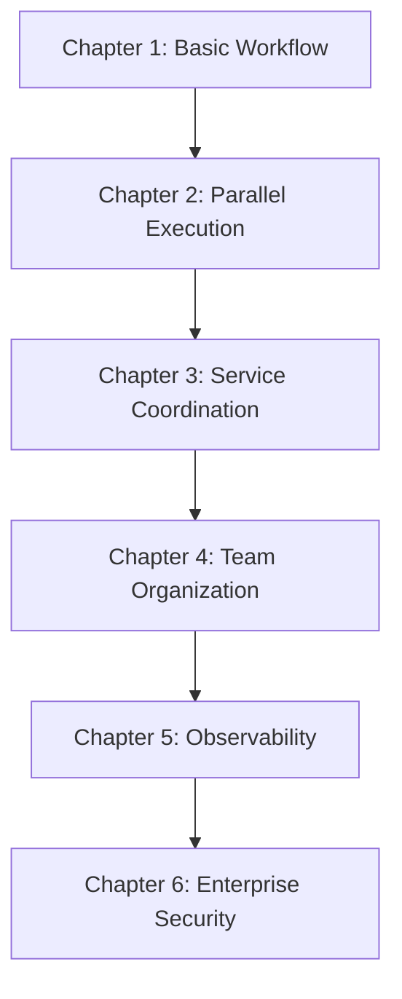

# System Patterns: GitBook Architecture & Content Organization

## GitBook Architecture

### Core Structure
```
tasker-blog/
├── README.md                    # Landing page and series overview
├── SUMMARY.md                   # GitBook navigation structure
├── getting-started.md           # Reader onboarding
├── book.json                    # GitBook configuration
├── package.json                 # Node.js dependencies
├── styles/website.css           # Custom styling
├── blog/posts/                  # Main content chapters
├── docs/                        # Developer reference
├── appendices/                  # Supporting materials
├── .cursor/                     # Development tools (excluded from GitBook)
└── memory-bank/                 # Project context (excluded from GitBook)
```

### Content Hierarchy

#### Primary Navigation (SUMMARY.md)
- **Introduction**: Landing and getting started
- **Part I: Foundation Stories**: Chapters 1-2 (basic patterns)
- **Part II: Advanced Patterns**: Chapter 3 (microservices)
- **Part III: Scale & Enterprise**: Chapters 4-6 (team/production concerns)
- **Developer Documentation**: Technical reference
- **Appendices**: Supporting materials

#### Chapter Structure Pattern
Each chapter follows consistent organization:
```
post-XX-topic-name/
├── README.md                    # Chapter overview and navigation
├── blog-post.md                 # Main narrative content
├── preview.md                   # Teaser for unreleased chapters
├── code-examples/               # Complete working implementations
│   ├── README.md               # Code overview
│   ├── step_handlers/          # Individual workflow steps
│   ├── task_handler/           # Main workflow orchestration
│   ├── models/                 # Data models
│   ├── config/                 # Configuration files
│   └── demo/                   # Demo/testing scripts
├── setup-scripts/              # One-command installation
│   ├── README.md               # Setup instructions
│   ├── setup.sh                # Main setup script
│   └── blog-setup.sh           # GitBook-specific setup
└── TESTING.md                  # Testing and troubleshooting
```

## Content Organization Patterns

### Narrative Continuity
- **Character Development**: Sarah's team evolves across chapters
- **Technical Progression**: Each chapter builds on previous patterns
- **Business Context**: Same company (GrowthCorp) with growing complexity
- **Code Evolution**: Examples reference and extend previous implementations

### Learning Progression


### Code Example Strategy
- **Immediate Runnable**: Every example works with single command
- **Production Quality**: Real error handling, logging, monitoring
- **Progressive Complexity**: Simple → Advanced → Enterprise patterns
- **Consistent Domain**: E-commerce scenarios throughout

## GitBook Configuration Patterns

### Plugin Architecture (book.json)
- **github**: Repository integration and source links
- **edit-link**: Community contribution workflow
- **copy-code-button**: Enhanced code block usability
- **prism**: Syntax highlighting for Ruby, Bash, YAML
- **anchorjs**: Deep linking for sections
- **ga**: Analytics integration
- **sitemap-general**: SEO optimization

### Custom Styling Strategy
- **Dark code themes**: Better readability for code examples
- **Callout styling**: Consistent visual hierarchy for tips/warnings
- **Mobile responsive**: Optimized for all device types
- **Print optimization**: PDF export formatting

### Variable Management
- **Version tracking**: Tasker version consistency across examples
- **URL management**: Centralized link management
- **Installation URLs**: Single source of truth for setup scripts

## Content Development Patterns

### Chapter Development Workflow
1. **Story Development**: Narrative arc with character continuity
2. **Technical Design**: Working code implementation
3. **Setup Automation**: One-command installation script
4. **Testing Validation**: Comprehensive failure scenario testing
5. **Documentation Integration**: GitBook formatting and navigation
6. **Community Review**: Feedback integration and refinement

### Code Quality Standards
- **Working Examples**: All code must run immediately
- **Error Handling**: Production-quality error management
- **Documentation**: Inline comments explaining Tasker patterns
- **Testing**: Comprehensive test coverage with failure scenarios
- **Monitoring**: Built-in observability and debugging

### Release Strategy
- **Sequential Rollout**: Chapters released individually for feedback
- **Preview System**: Unreleased chapters show coming soon content
- **Feedback Integration**: Community input shapes subsequent chapters
- **Version Consistency**: All examples use same Tasker version

## Repository Exclusion Patterns

### Development Tools Exclusion
Files/directories excluded from GitBook publishing:
- `.cursor/` - Development environment configuration
- `memory-bank/` - Project context documentation
- `.ruby-lsp/` - Ruby language server cache
- `.git/` - Version control metadata

### GitBook Ignore Strategy
Methods to exclude development files:
1. **GitBook.com Settings**: Configure ignored paths in GitBook dashboard
2. **.bookignore File**: Create explicit exclusion list (if supported)
3. **SUMMARY.md Control**: Only include intended files in navigation
4. **Directory Structure**: Keep excluded files in non-published directories

## Integration Patterns

### External Tool Integration
- **GitHub**: Source code repository and issue tracking
- **Tasker Engine**: Core workflow orchestration system
- **Setup Scripts**: Automated environment configuration
- **Testing Infrastructure**: Validation and troubleshooting

### Community Contribution Workflow
- **Edit Links**: Direct GitHub editing from GitBook pages
- **Issue Tracking**: Centralized problem reporting
- **Discussion Forums**: Community questions and patterns
- **Example Improvements**: Community code contributions

### Analytics and Feedback
- **Usage Tracking**: Reader engagement and popular content
- **Setup Success**: Installation script execution rates
- **Community Health**: Discussion activity and contribution levels
- **Business Impact**: Tasker adoption and enterprise interest
