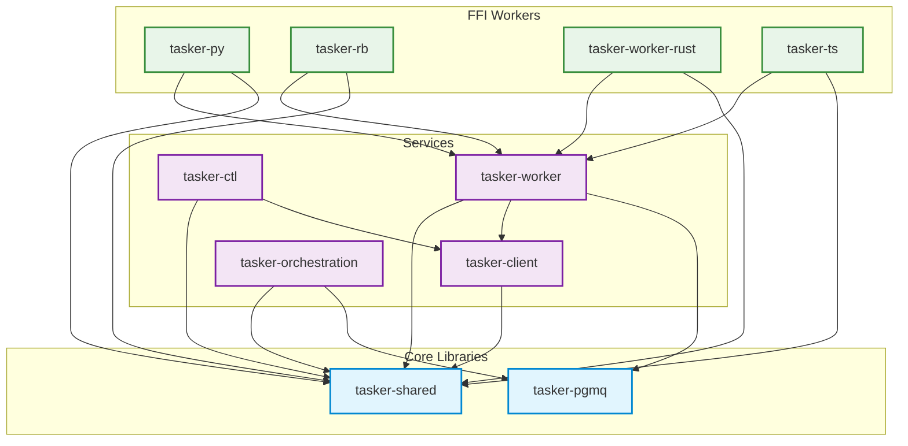

# Crate Dependency Graph

> Auto-generated from `Cargo.toml` workspace analysis. Do not edit manually.
>
> Regenerate with: `cargo make generate-crate-deps`

This diagram shows the inter-crate dependency structure of the tasker-core workspace.
Arrows point from dependent to dependency (A → B means "A depends on B").

## Workspace Crates

| Crate | Category | Dependencies |
|-------|----------|-------------|
| `tasker-pgmq` | Core Library | *(none)* |
| `tasker-client` | Service | `tasker-shared` |
| `tasker-ctl` | Service | `tasker-client`, `tasker-shared` |
| `tasker-orchestration` | Service | `tasker-pgmq`, `tasker-shared` |
| `tasker-shared` | Core Library | *(none)* |
| `tasker-worker` | Service | `tasker-pgmq`, `tasker-client`, `tasker-shared` |
| `tasker-py` | FFI Worker | `tasker-shared`, `tasker-worker` |
| `tasker-rb` | FFI Worker | `tasker-shared`, `tasker-worker` |
| `tasker-worker-rust` | FFI Worker | `tasker-core`, `tasker-shared`, `tasker-worker` |
| `tasker-ts` | FFI Worker | `tasker-shared`, `tasker-worker` |

---

*Generated by `generate-crate-deps.sh` from tasker-core workspace analysis*
