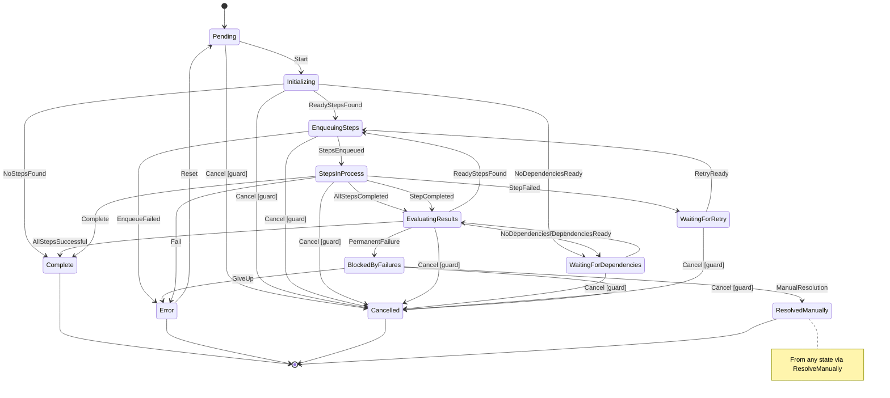
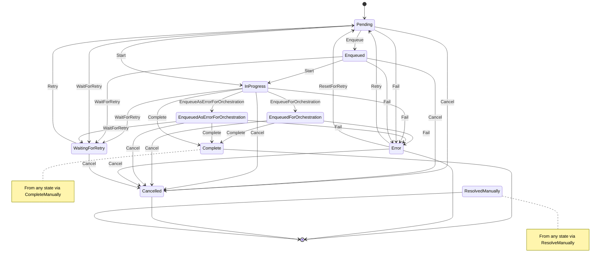

# State Machine Diagrams

> Auto-generated from Rust source analysis. Do not edit manually.
>
> Regenerate with: `cargo make generate-state-machines`

Tasker uses two state machines to manage the lifecycle of tasks and workflow steps.
Both are implemented in `tasker-shared/src/state_machine/`.

## Task State Machine

The task state machine manages the overall lifecycle of a task through 12 states.
Tasks progress from `Pending` through initialization, step enqueuing, processing,
and evaluation phases, with support for dependency waiting, retry, and manual resolution.

### Task State Transitions

| From State | Event | To State | Notes |
|-----------|-------|----------|-------|
| Pending | Start | Initializing |  |
| Initializing | ReadyStepsFound | EnqueuingSteps |  |
| Initializing | NoStepsFound | Complete |  |
| Initializing | NoDependenciesReady | WaitingForDependencies |  |
| EnqueuingSteps | StepsEnqueued | StepsInProcess |  |
| EnqueuingSteps | EnqueueFailed | Error |  |
| StepsInProcess | AllStepsCompleted | EvaluatingResults |  |
| StepsInProcess | StepCompleted | EvaluatingResults |  |
| StepsInProcess | StepFailed | WaitingForRetry |  |
| EvaluatingResults | AllStepsSuccessful | Complete |  |
| EvaluatingResults | ReadyStepsFound | EnqueuingSteps |  |
| EvaluatingResults | NoDependenciesReady | WaitingForDependencies |  |
| EvaluatingResults | PermanentFailure | BlockedByFailures |  |
| WaitingForDependencies | DependenciesReady | EvaluatingResults |  |
| WaitingForRetry | RetryReady | EnqueuingSteps |  |
| BlockedByFailures | GiveUp | Error |  |
| BlockedByFailures | ManualResolution | ResolvedManually |  |
| *(any non-terminal)* | Cancel | Cancelled | Guard: `!state.is_terminal()` |
| StepsInProcess | Complete | Complete |  |
| StepsInProcess | Fail | Error |  |
| Error | Reset | Pending |  |
| *(any non-terminal)* | ResolveManually | ResolvedManually |  |

## Workflow Step State Machine

The workflow step state machine manages individual step execution through 10 states.
Steps follow a worker-to-orchestration handoff pattern: workers execute steps and
enqueue results for orchestration processing.

### Workflow Step State Transitions

| From State | Event | To State |
|-----------|-------|----------|
| Pending | Enqueue | Enqueued |
| Enqueued | Start | InProgress |
| Pending | Start | InProgress |
| InProgress | EnqueueForOrchestration | EnqueuedForOrchestration |
| InProgress | EnqueueAsErrorForOrchestration | EnqueuedAsErrorForOrchestration |
| EnqueuedForOrchestration | Complete | Complete |
| EnqueuedForOrchestration | Fail | Error |
| EnqueuedAsErrorForOrchestration | Fail | Error |
| EnqueuedAsErrorForOrchestration | Complete | Complete |
| InProgress | Complete | Complete |
| InProgress | Fail | Error |
| Pending | Fail | Error |
| Enqueued | Fail | Error |
| Pending | Cancel | Cancelled |
| Enqueued | Cancel | Cancelled |
| InProgress | Cancel | Cancelled |
| EnqueuedForOrchestration | Cancel | Cancelled |
| EnqueuedAsErrorForOrchestration | Cancel | Cancelled |
| Error | Cancel | Cancelled |
| Error | Retry | Pending |
| InProgress | WaitForRetry | WaitingForRetry |
| Enqueued | WaitForRetry | WaitingForRetry |
| Pending | WaitForRetry | WaitingForRetry |
| EnqueuedAsErrorForOrchestration | WaitForRetry | WaitingForRetry |
| WaitingForRetry | Retry | Pending |
| WaitingForRetry | Cancel | Cancelled |
| *(any state)* | CompleteManually | Complete |
| *(any state)* | ResolveManually | ResolvedManually |
| Error | ResetForRetry | Pending |

---

*Generated by `generate-state-machines.sh` from tasker-core Rust source analysis*
